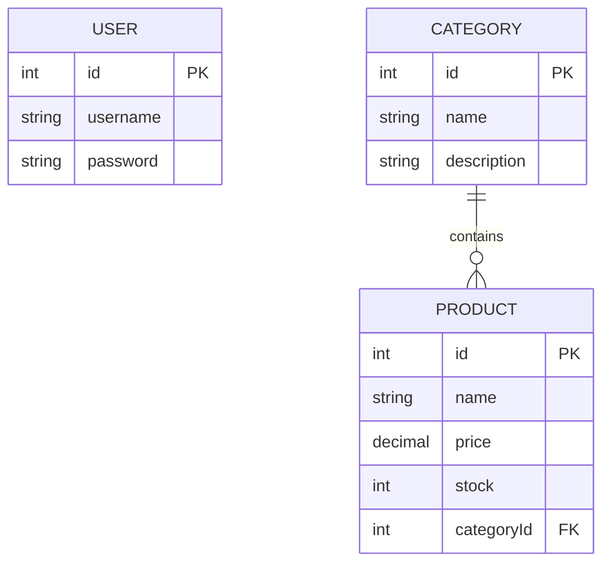
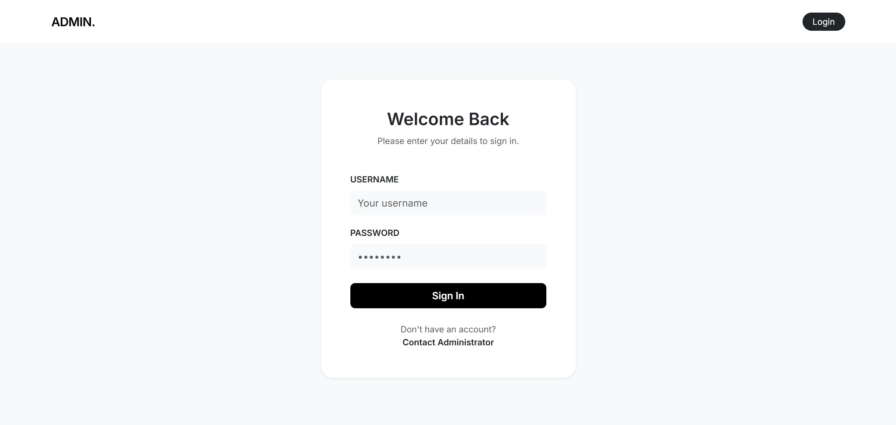
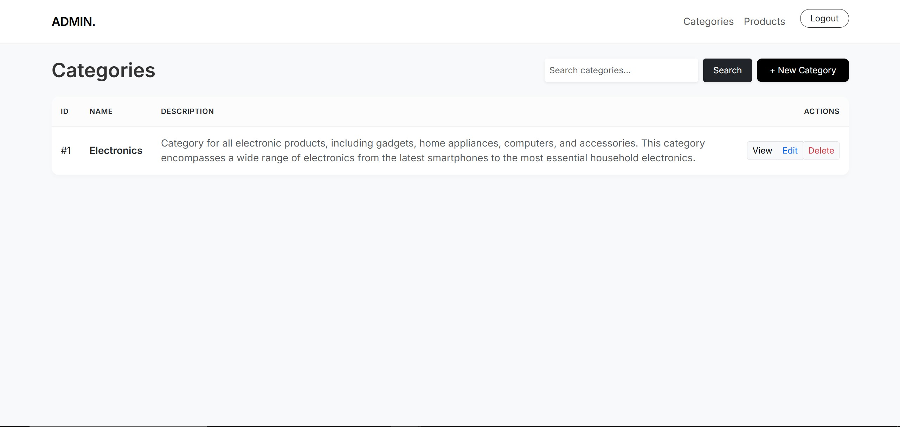
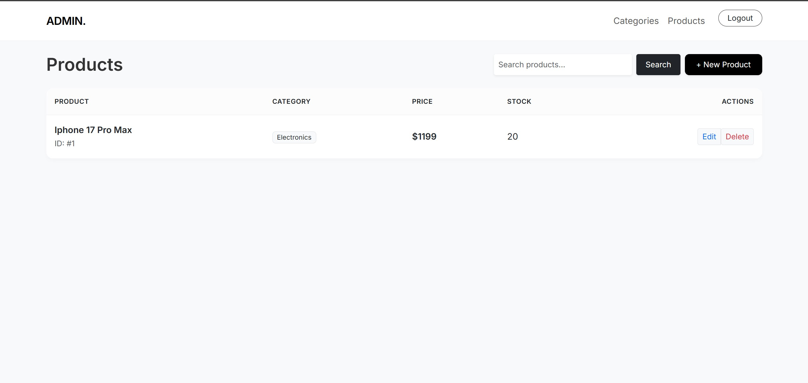

# NestJS Admin Panel - Challenge Fullstack

A modern, minimalist Admin Panel built with NestJS using the MVC (Model-View-Controller) pattern. This project manages a simple inventory system with Categories and Products, featuring secure authentication and dynamic search.

## 🚀 Features

- **Authentication System**: Secure login/logout using `passport-local` and `express-session`.
- **CRUD Operations**: Complete management for Categories and Products.
- **One-to-Many Relationship**: Each Product is linked to a Category.
- **Dynamic Search**: Real-time filtering for both Categories and Products.
- **Global Error Handling**: Custom exception filter to render user-friendly error pages (404, 500, etc.).
- **Minimalist UI**: Styled with Bootstrap 5 and Inter font for a clean, professional look.

---

## 📊 Database Design

The system uses SQLite for simplicity and portability. Below is the Entity-Relationship Diagram (ERD):



---

## 📸 Screenshots

| Login Page | Dashboard / Categories | Product Management |
| :--- | :--- | :--- |
|  |  |  |

---

## 🛠️ Tech Stack & Dependencies

### Core Framework
- **NestJS**: A progressive Node.js framework.
- **TypeScript**: Typed superset of JavaScript.

### View Engine (MVC)
- **Handlebars (HBS)**: Template engine for server-side rendering.
- **Bootstrap 5**: CSS framework for UI styling.

### Database & ORM
- **TypeORM**: Data mapper ORM for TypeScript.
- **SQLite3**: Lightweight relational database.

### Security & Auth
- **Passport.js**: Authentication middleware.
- **Bcrypt**: Password hashing for security.
- **Express Session**: Session-based authentication.

---

## ⚙️ Installation & Setup

1. **Clone the repository**:
   ```bash
   git clone <your-repository-url>
   cd nest-admin-panel
   ```

2. **Install dependencies**:
   ```bash
   npm install
   ```

3. **Environment Configuration**:
   The project uses SQLite, so no external database setup is required. The database file (`database.sqlite`) will be generated automatically.

4. **Run the application**:
   ```bash
   npm run start:dev
   ```

5. **Access the application**:
   Open `http://localhost:3000` in your browser.

### 🔑 Default Credentials
- **Username**: `admin`
- **Password**: `admin123`
*(Admin account is automatically seeded on the first run)*

---

## 👨‍💻 Development Guide

- **Entities**: Located in `src/**/entities/*.entity.ts`.
- **Controllers (Routes)**: Located in `src/**/*.controller.ts`.
- **Views (HTML)**: Located in the `views/` directory.
- **Error Handling**: Managed by `src/common/filters/http-exception.filter.ts`.

---